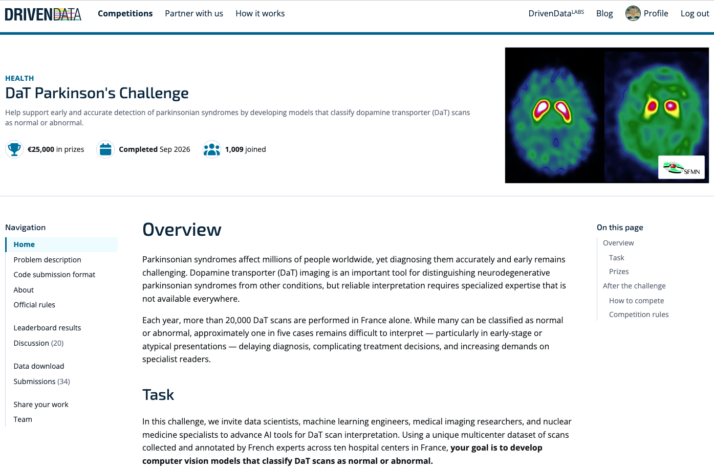
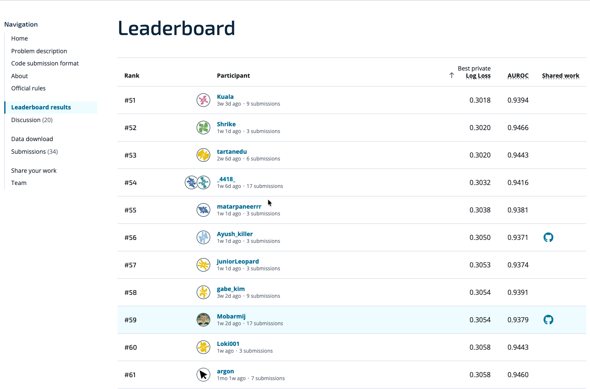
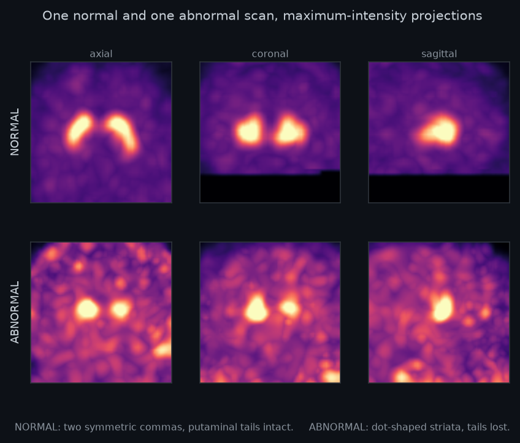
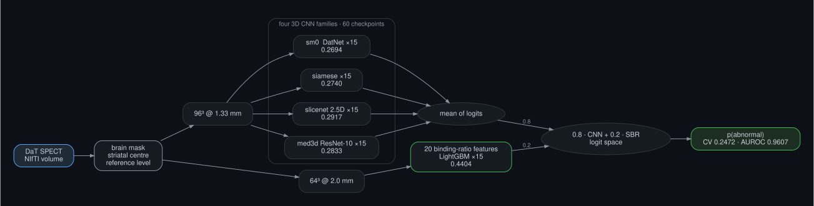
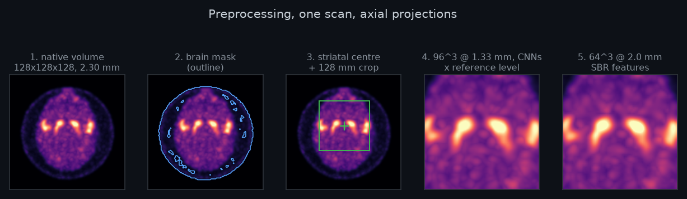
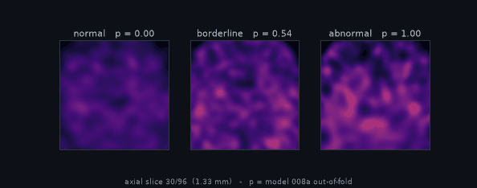
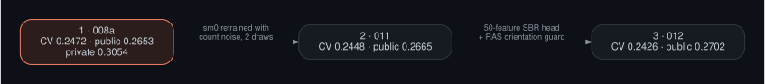
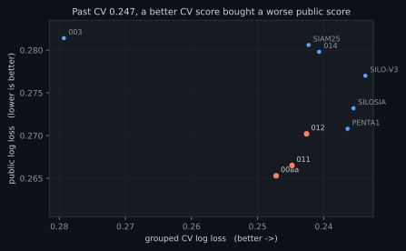
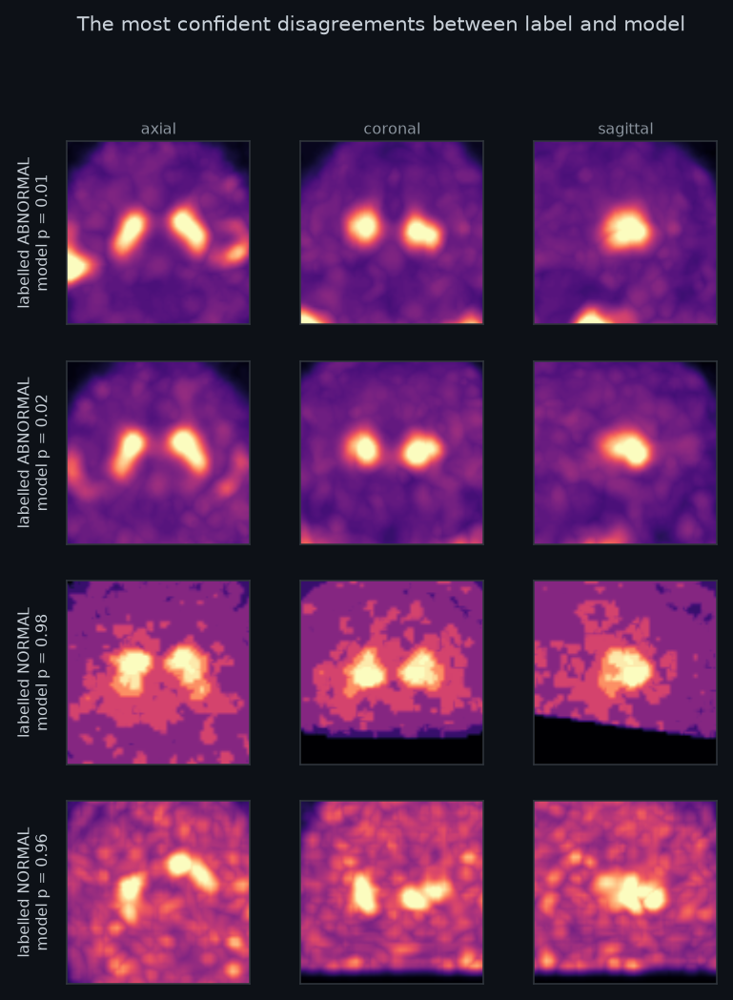

# DaT SPECT — abnormality classification

Classifies a dopamine-transporter (DaT) SPECT brain scan as normal or abnormal, from the scan alone.

Built for the DrivenData *DaT Parkinson's Challenge* (closed 2026-09-15) by **Aissam Djahnine (team
Mobarmij)**. Final standing: **59th on the private leaderboard**, log loss 0.3054, AUROC 0.9379.

| # | model | grouped CV | public | private |
|---|---|---|---|---|
| **1** | **[`008a`](solutions/1_008a)** — four 3D CNN families + a binding-ratio head | 0.2472 | **0.2653** | **0.3054 — 59th** |
| 2 | [`011`](solutions/2_011) — 008a, one family retrained under count noise | 0.2448 | 0.2665 | |
| 3 | [`012`](solutions/3_012) — 011, a richer feature head and an orientation guard | **0.2426** | 0.2702 | |

Read the table by column: each model is better than the one above it on cross-validation, and worse on
the leaderboard. That gap is the most useful result in this repository, and
[the section on it](#what-transferred-and-what-did-not) explains why.

This is the cleaned residue of the work: the three best submissions, the code that reproduces them, and
[the lessons](notes/LESSONS.md). Around forty exploratory experiments were left behind.

---

## Competition results

The competition page records **1,009 joined**. Team **Mobarmij** finished **59th on the private
leaderboard**, with log loss **0.3054** and AUROC **0.9379**.





---

## Quick start

```bash
uv sync                                        # Python 3.12, CUDA 12.9 torch, exact pins in uv.lock
ln -s /path/to/competition/data data           # data/niftis/*.nii.gz + data/train_labels.csv
```

Inference with trained weights (staged into `solutions/<model>/assets/` by `scripts/pack.sh`):

```bash
DATPARK_DATA_DIR=/path/with/niftis uv run python solutions/1_008a/main.py   # -> submission.csv
```

`DATPARK_DATA_DIR` holds `niftis/` and `submission_format.csv`. The program runs each scan
independently, fits nothing at inference and needs no network.

---

## The problem

A DaT scan images dopamine transporter density in the striatum. A **normal** study shows two
symmetric comma-shaped striata with intact putaminal tails. An **abnormal** study shows dot-shaped
striata with the tails lost, often asymmetric: the imaging signature of a parkinsonian syndrome.



The training set is 1,362 scans, 747 abnormal and 615 normal, from several hospitals and scanner
types. The metric is log loss. Two facts shaped every decision:

- **The site is in the pixels.** Scanner metadata alone predicts the label at AUROC 0.726 under random
  folds and only 0.533 under folds grouped by acquisition site. Every number here is grouped CV.
- **Intensity is not comparable across sites.** Raw counts span a 16,000-fold range between centres,
  so each scan is divided by its own non-specific reference level before anything else.

---

## Approach



Each scan is decoded once, masked, centred on the striatum and divided by its own reference level,
then resampled to two grids. Four CNN families read the 96³ grid; a LightGBM head reads 20
striatal-binding-ratio features from the 64³ grid. The two are fused in logit space, 0.8 to 0.2.



<p align="center"></p>

*An axial sweep through a normal, a borderline and an abnormal scan, with the 008a out-of-fold
prediction for each.*

| family | architecture | checkpoints | test-time views | OOF log loss |
|---|---|---|---|---|
| `sm0` | DatNet, 3D CNN, stride-3 stem | 15 | S-I and R-L flips | 0.2694 |
| `siamese` | shared-weight hemisphere comparison | 15 | S-I flips, rotation, scale | 0.2740 |
| `slicenet` | 2.5D slice encoder | 15 | R-L flip | 0.2917 |
| `med3d` | ResNet-10, MedicalNet init, z-scored | 15 | R-L flip | 0.2833 |
| SBR head | LightGBM on 20 binding-ratio features | 15 | — | 0.4404 |

**The weakest member earns its seat.** The SBR head scores 0.4404 on its own, far behind every CNN, yet
removing it costs 0.0055. It is a different modality, a few numbers a clinician would also read, and its
errors are the least correlated with the CNNs'.

**No calibration is applied.** Cross-fitted temperature scaling measured worse.

---

## The top 3



| | what changes | why |
|---|---|---|
| **008a** | the base: four CNN families + SBR head | simplest blend; never beaten publicly |
| **011** | `sm0` retrained with an added, spatially correlated count-noise field; two training draws pooled into 30 checkpoints | noise level differs between acquisition sites; pooling avoids shipping the luckier draw |
| **012** | 011's 75 CNN checkpoints unchanged; SBR head refitted on 50 multiscale features; every volume canonicalised to RAS on load | a richer feature head, and a guard so a non-RAS scan cannot have its laterality transposed |

Each `solutions/<n>_<model>/` folder is the exact program that was submitted: `main.py`, its own copy of
the `datpark` modules it imports, and `assets/config.json`.

---

## What transferred, and what did not



Nine challengers were flown against 008a. **All nine lost on the public leaderboard** (sign test
p = 0.002), including every model with a better cross-validated score. Past a CV of about 0.247, the search
was most likely fitting this cohort's acquisition mix rather than finding better readers.

What we did about it, and what we would keep:

- **Grouped, nested cross-validation as the only instrument**, with every stage cross-fitted.
  Nesting only the last stage once leaked 0.046 log loss.
- **Selection inflation priced explicitly.** The best of 297 arms keeps only 0.24 of its apparent edge.
- **Readings frozen before scores.** Each submission's interpretation bands were committed before the
  score landed, so no result could be re-read to taste.
- **Gates before every upload:** test suite, local inference, container run, then submit.

The public split is about 145 scans, and the private split then moved 008a from 0.2653 to 0.3054.
Differences of a few thousandths between models on either board are within noise.

---

## The hardest cases



*The scans where the label and 008a disagree most confidently. The top two are labelled abnormal and
read as normal; the bottom two are labelled normal and read as abnormal.*

The loss is concentrated in this tail: 144 of 1,362 scans are misclassified and carry 65% of the total
out-of-fold loss. An automated blinded re-read of such cases came back at chance, so we could not
tell label noise from model error.

---

## Reproducing

Everything was trained on one workstation:

| | |
|---|---|
| GPU | NVIDIA GeForce RTX 4080 SUPER, 16 GB (driver 560, CUDA 12.9) |
| CPU | Intel Core i7-14700KF, 28 threads |
| RAM | 32 GB |
| OS | Ubuntu 24.04, Python 3.12, PyTorch 2.12.1 |

| step | time on that machine |
|---|---|
| preprocessing caches (64³ and 96³) | ~50 min, CPU |
| `sm0`, `siamese` | ~9 min each, GPU |
| `slicenet` | ~85 min, GPU |
| `med3d` | ~20 min, GPU |
| 011's two count-noise draws of `sm0` | ~50 min, GPU |
| SBR heads (both) | minutes, CPU |

Any single CUDA GPU with 16 GB should work. Each recipe is a short, readable shell script.

```bash
bash recipes/common.sh     # inventory, grouped folds, 64³ and 96³ caches      ~50 min, CPU
bash recipes/008a.sh       # SBR head + four CNN families, then pack            ~2 h, GPU
bash recipes/011.sh        # two count-noise draws of sm0, then pack            ~1 h, GPU
bash recipes/012.sh        # 50-feature SBR head + orientation check, then pack  minutes, CPU
```

`scripts/pack.sh <model>` stages the weights, runs the tests, optionally runs inference on a demo folder
(`DEMO=...`), and writes `dist/<model>_submission.zip`. It refuses to overwrite an archive.

```bash
uv run python tests/run_tests.py      # 104 tests, ~10 s, no GPU
```

The folds are frozen: `make_folds.py` must never be re-run with another seed, or no out-of-fold number
here stays comparable. The MedicalNet family is not bit-reproducible (PyTorch has no deterministic
`max_pool3d` backward on CUDA); retrains move the blend by about 0.0003.

---

## Layout

| path | contents |
|---|---|
| `solutions/` | the three submitted programs, each self-contained |
| `datpark/` | the engine: preprocessing, the four architectures, features, losses, folds, metrics |
| `scripts/` | caching, training, TTA scoring, verification and packing |
| `recipes/` | one launcher per model, plus the shared preprocessing |
| `tests/` | contract and numerical tests, dependency-free runner |
| `notes/` | [LESSONS.md](notes/LESSONS.md): what cost us, so it need not cost you |
| `docs/` | README figures; diagrams from `docs/diagrams/*.dot`, charts from `docs/make_charts.py` |

---

## References

| used in | source |
|---|---|
| 011, 012 — `datpark/augment3.py`, the added count-noise field | T. Buddenkotte, R. Buchert. *Unrealistic data augmentation improves the robustness of deep learning-based classification of dopamine transporter SPECT against variability between sites and between cameras.* J Nucl Med 65(9):1463, 2024. [doi:10.2967/jnumed.124.267570](https://doi.org/10.2967/jnumed.124.267570) |
| `med3d` initialisation | S. Chen, K. Ma, Y. Zheng. *Med3D: Transfer learning for 3D medical image analysis.* [arXiv:1904.00625](https://arxiv.org/abs/1904.00625), 2019. Weights: [MedicalNet](https://github.com/Tencent/MedicalNet), MIT |
| `med3d` backbone | K. He, X. Zhang, S. Ren, J. Sun. *Deep residual learning for image recognition.* CVPR 2016. [arXiv:1512.03385](https://arxiv.org/abs/1512.03385) |
| SBR head | G. Ke et al. *LightGBM: A highly efficient gradient boosting decision tree.* NeurIPS 2017 |

---

## Licence and data

Code is MIT-licensed; see [LICENSE](LICENSE). The competition scans and labels are not redistributed
here, and no trained weights are committed. The `med3d` family is initialised from MedicalNet
(Chen, Ma and Zheng, 2019, MIT), downloaded by `scripts/fetch_medicalnet.sh`; its use was disclosed to
the organisers. No external DaT data was used.
